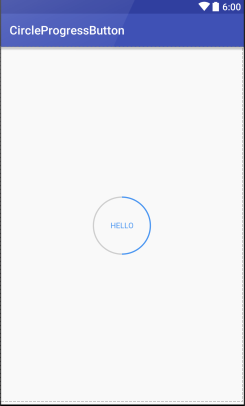

# CircleProgressButton
> 这是一个圆形带进度的按钮,仿网易启动页做的.

### 使用
``` xml
<cn.isif.widget.CircleProgress
        app:c_max="100"
        app:c_text="HELLO"
        app:c_progress="50"
        app:c_circle_starting_degree="-90"
        android:layout_centerInParent="true"
        android:layout_width="100dp"
        android:layout_height="100dp"/>
```

### 效果
